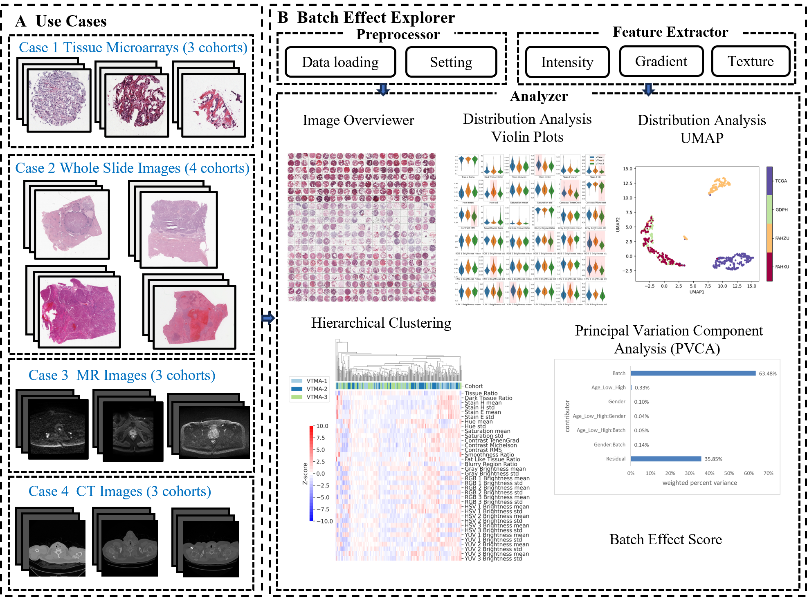
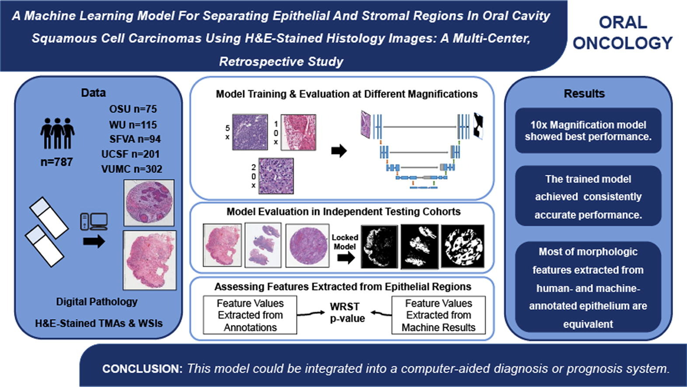

# Research

## 	Batch Effect Explorer for Imaging Analysis
[[paper]](https://pmc.ncbi.nlm.nih.gov/articles/PMC11735318/) 
[[code]](https://github.com/wuusn/beex) 

BEEx is a pre-screening tool for image-based analyses that allows researchers to evaluate batch effects in multi-center studies and determine their origin and magnitude to facilitate development of accurate AI-based cancer models.  
> Wu Y, Xu X, Cheng Y, Zhang X, Liu F, Li Z, Hu L, Madabhushi A, Gao P, Liu Z, Lu C. BEEx Is an Open-Source Tool That Evaluates Batch Effects in Medical Images to Enable Multicenter Studies. Cancer Res. 2025 Jan 15;85(2):218-230. doi: 10.1158/0008-5472.CAN-23-3846. PMID: 39661030; PMCID: PMC11735318.

## Separating Epithelial and Stromal Regions in Oral Cavity Squamous Cell Carcinomas
[[paper]](https://pubmed.ncbi.nlm.nih.gov/35689952/)
[[code]](https://github.com/wuusn/oral_epi_segmentation)

* The proposed model achieved a consistently accurate performance for epithelium segmentation.
* The model trained on 10x magnification images achieved the best performance.
* Morphologic features extracted from human- and AI-annotated epithelial regions are equivalent.
  
> Wu Y, Koyuncu CF, Toro P, Corredor G, Feng Q, Buzzy C, Old M, Teknos T, Connelly ST, Jordan RC, Lang Kuhs KA, Lu C, Lewis JS Jr, Madabhushi A. A machine learning model for separating epithelial and stromal regions in oral cavity squamous cell carcinomas using H&E-stained histology images: A multi-center, retrospective study. Oral Oncol. 2022 Aug;131:105942. doi: 10.1016/j.oraloncology.2022.105942. Epub 2022 Jun 8. PMID: 35689952. 

